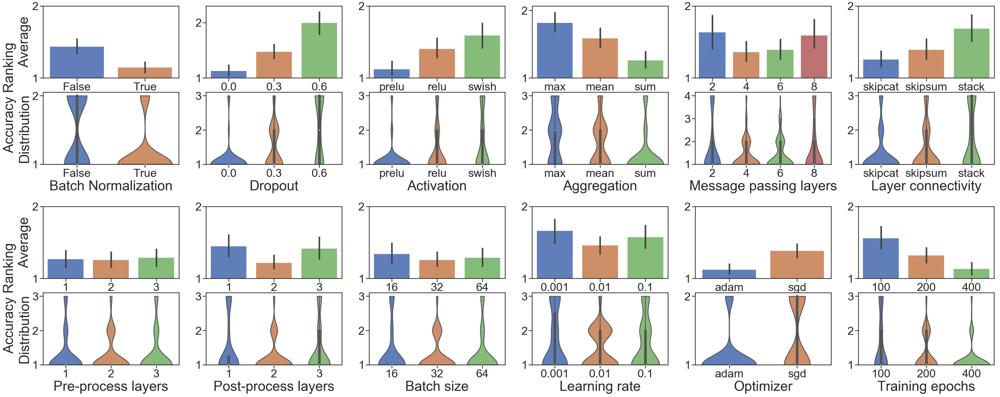
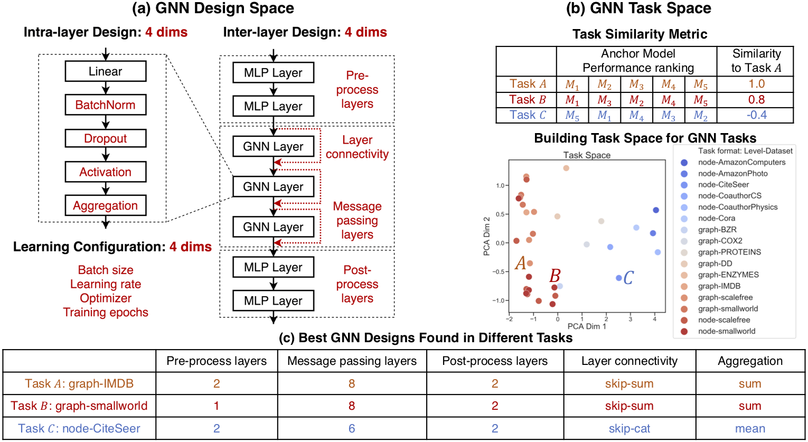

# GraphGym
GraphGym is a platform for designing and evaluating Graph Neural Networks (GNN).
### Highlights
**1. Highly modularized pipeline for GNN**
- **Data:** Data loading, data splitting
- **Model:** Modularized GNN implementation
- **Tasks:** Node / edge / graph level GNN tasks
- **Evaluation:** Accuracy, ROC AUC, ...

**2. Reproducible experiment configuration** 
- Each experiment is *fully described by a configuration file*

**3. Scalable experiment management**
- Easily launch *thousands of GNN experiments in parallel* 
- *Auto-generate* experiment analyses and figures across random seeds and experiments.

**4. Flexible user customization**
- Easily *register your own modules* in [`graphgym/contrib/`](graphgym/contrib), such as data loaders, GNN layers, loss functions, etc. 

## Why GraphGym?
**TL;DR:** GraphGym is great for GNN beginners, domain experts and GNN researchers.

**Scenario 1:** You are a beginner to GNN, who wants to understand how GNN works.

You probably have read many exciting papers on GNN, and try to write your own GNN implementation.
Using existing packages for GNN, you still have to code up the essential pipeline on your own.
GraphGym is a perfect place for your to start learning *standardized GNN implementation and evaluation*.

<div align="center">
  
  <figcaption><b><br>Figure 1: Modularized GNN implementation.</b></figcaption>
</div>

<br>

**Scenario 2:** You want to apply GNN to your exciting applications.

You probably know that there are hundreds of possible GNN models, and selecting the best model is notoriously hard.
Even worse, we have shown in our [paper](https://arxiv.org/abs/2011.08843) that the best GNN designs for different tasks differ drastically.
GraphGym provides a *simple interface to try out thousands of GNNs in parallel* and understand the best designs for your specific task.
GraphGym also recommends a "go-to" GNN design space, after investigating 10 million GNN model-task combinations.

<div align="center">
  
  <figcaption><b><br>Figure 2: A guideline for desirable GNN design choices. <br>(Sampling from 10 million GNN model-task combinations.) </b></figcaption>
</div>

<br>


**Scenario 3:** You are a GNN researcher, who want to innovate GNN models / propose new GNN tasks.

Say you have proposed a new GNN layer `ExampleConv`.
GraphGym can help you convincingly argue that `ExampleConv` is better than say `GCNConv`:
when randomly sample from 10 millions possible model-task combinations, how often `ExampleConv` will outperform `GCNConv`, when everything else is fixed (including the computational cost). 
Moreover, GraphGym can help you easily do hyper-parameter search, and *visualize* what design choices are better.
In sum, GraphGym can greatly facilitate your GNN research.

<div align="center">
  
  <figcaption><b><br>Figure 3: Evaluation of a given GNN design dimension (BatchNorm here).</b></figcaption>
</div>

<br>

## Installation

**Requirements**

- CPU or NVIDIA GPU, Linux, Python3
- PyTorch, various Python packages; Instructions for installing these dependencies are found below


**1. Python environment**
We recommend using Conda package manager

```bash
conda create -n graphgym python=3.7
source activate graphgym
```

**2. Pytorch:**
Install [PyTorch](https://pytorch.org/). 
We have verified under PyTorch 1.4.0 and torchvision 0.5.0. For example:
```bash
pip install torch==1.4.0 torchvision==0.5.0
```

**3. Pytorch Geometric:**
Install [PyTorch Geometric](https://pytorch-geometric.readthedocs.io/en/latest/notes/installation.html), 
follow their instructions. For example:
```bash
# CUDA versions: cpu, cu92, cu101, cu102, cu110
# TORCH versions: 1.4.0, 1.5.0, 1.6.0, 1.7.0
CUDA=cu101
TORCH=1.4.0
pip install torch-scatter==latest+${CUDA} -f https://pytorch-geometric.com/whl/torch-${TORCH}.html
pip install torch-sparse==latest+${CUDA} -f https://pytorch-geometric.com/whl/torch-${TORCH}.html
pip install torch-cluster==latest+${CUDA} -f https://pytorch-geometric.com/whl/torch-${TORCH}.html
pip install torch-spline-conv==latest+${CUDA} -f https://pytorch-geometric.com/whl/torch-${TORCH}.html
pip install torch-geometric
```

**4. Clone GraphGym and install other dependencies:**

```bash
git clone https://github.com/snap-stanford/GraphGym
cd GraphGym
pip install -r requirements.txt
python setup.py develop
```


**5. Test the installation**

Run a test GNN experiment using GraphGym, specified in [`run/configs/example.yaml`](run/configs/example.yaml). 
The experiment is about node classification on Cora dataset (random 80/20 train/val split).
```bash
cd run
bash run_single.sh
```

## GraphGym Usage

### 1 Run a single GNN experiment
A full example is specified in [`run/run_single.sh`](run/run_single.sh).

**1.1 Specify a configuration file.**
In GraphGym, an experiment is fully specified by a `.yaml` file.
Unspecified configurations in the `.yaml` file will be populated by the default values in [`graphgym/config.py`](graphgym/config.py).
For example, in [`run/configs/example.yaml`](run/configs/example.yaml), there are configurations on dataset, training, model, GNN, etc.
Descriptions for each configuration is described also in [`graphgym/config.py`](graphgym/config.py).

**1.2 Launch an experiment.**
For example, in [`run/run_single.sh`](run/run_single.sh):
```bash
python main.py --cfg configs/example.yaml --repeat 3
```
You can specify the number of different random seeds to repeat via `--repeat`.

**1.3 Understand the results.**
Experimental results will be automatically saved in directory `run/results/${CONFIG_NAME}/`; 
in the example above, it is `run/results/example/`.
Results for different random seeds will be saved in different subdirectories, such as `run/results/example/2`.
The aggregated results over all the random seeds are *automatically* generated into `run/results/example/agg`,
including the mean and standard deviation `_std` for each metric.
Train/val/test results are further saved into subdirectories, such as `run/results/example/agg/val`; here, 
`stats.json` stores the results after each epoch aggregated across random seeds, 
`best.json` stores the results at *the epoch with the highest validation accuracy*.

### 2 Run a batch of GNN experiments
A full example is specified in [`run/run_batch.sh`](run/run_batch.sh).

**2.1 Specify a base file.**
GraphGym supports running a batch of experiments.
To start, a user needs to select a base architecture `--config`.
The batch of experiments will be created by perturbing certain configurations of the base architecture.

**2.2 (Optional) Specify a base file for computational budget.**
Additionally, GraphGym allows a user to select a base architecture to *control the computational budget* for the grid search, `--config_budget`.
The computational budget is currently measured by the number of trainable parameters; the control is achieved by auto-adjust
the hidden dimension size for GNN.
If no `--config_budget` is provided, GraphGym will not control the computational budget.

**2.3 Specify a grid file.**
A grid file describes how to perturb the base file, in order to generate the batch of the experiments.
For example, the base file could specify an experiment of 3-layer GCN for Cora node classification.
Then, the grid file specifies how to perturb the experiment along different dimension, such as number of layers,
model architecture, dataset, level of task, etc.

 
**2.4 Generate config files for the batch of experiments,** based on the information specified above.
For example, in [`run/run_batch.sh`](run/run_batch.sh):
```bash
python configs_gen.py --config configs/${DIR}/${CONFIG}.yaml \
  --config_budget configs/${DIR}/${CONFIG}.yaml \
  --grid grids/${DIR}/${GRID}.txt \
  --out_dir configs
```

**2.5 Launch the batch of experiments.**
For example, in [`run/run_batch.sh`](run/run_batch.sh):
```bash
bash parallel.sh configs/${CONFIG}_grid_${GRID} $REPEAT $MAX_JOBS $SLEEP
```
Each experiment will be repeated for `$REPEAT` times. 
We implemented a queue system to sequentially launch all the jobs, with `$MAX_JOBS` concurrent jobs running at the same time.
In practice, our system works great when handling thousands of jobs.

**2.6 Understand the results.**
Experimental results will be automatically saved in directory `run/results/${CONFIG_NAME}_grid_${GRID_NAME}/`; 
in the example above, it is `run/results/example_grid_example/`.
After running each experiment, GraphGym additionally automatically averages across different models, saved in
`run/results/example_grid_example/agg`. 
There, `val.csv` represents validation accuracy for each model configuration at the *final* epoch, 
and `val_best.csv` represents the results at the epoch with the highest validation error.
When test set split is provided, `test.csv` represents test accuracy for each model configuration at the *final* epoch, 
and `test_best.csv` represents the results at the epoch with the highest validation error.


### 3 Analyze the results
We provides a handy tool to automatically provide an overview of a batch of experiments in
[`analysis/example.ipynb`](analysis/example.ipynb).
```bash
cd analysis
jupyter notebook
example.ipynb   # automatically provide an overview of a batch of experiments
```


### 4 User customization
A highlight of GraphGym is that it allows users to easily register their customized modules.
The supported customized modules are provided in directory [`graphgym/contrib/`](graphgym/contrib/), including:
- Activation [`graphgym/contrib/act/`](graphgym/contrib/act/), 
- Configuration [`graphgym/contrib/config/`](graphgym/contrib/config/), 
- Feature augmentation [`graphgym/contrib/feature_augment/`](graphgym/contrib/feature_augment/), 
- Feature encoder [`graphgym/contrib/feature_encoder/`](graphgym/contrib/feature_encoder/),
- GNN head [`graphgym/contrib/head/`](graphgym/contrib/head/), 
- GNN layer [`graphgym/contrib/layer/`](graphgym/contrib/layer/), 
- Data loader [`graphgym/contrib/loader/`](graphgym/contrib/loader/),
- Loss function [`graphgym/contrib/loss/`](graphgym/contrib/loss/), 
- GNN network [`graphgym/contrib/network/`](graphgym/contrib/network/), 
- Optimizer [`graphgym/contrib/optimizer/`](graphgym/contrib/optimizer/),
- GNN global pooling (graph classification only) [`graphgym/contrib/pooling/`](graphgym/contrib/pooling/), 
- GNN stage [`graphgym/contrib/stage/`](graphgym/contrib/stage/), 
- Data transformations [`graphgym/contrib/transform/`](graphgym/contrib/transform/).

Within each directory, (at least) an example is provided, showing how to register user customized modules.
Note that new user customized modules may result in new configurations; in these cases, new configuration fields
should be registered at [`graphgym/contrib/config/`](graphgym/contrib/config/).

**Note: Applying to your own datasets.**
A common use case will be applying GraphGym to your favorite datasets.
To do so, you may follow our example in [`graphgym/contrib/loader/example.py`](graphgym/contrib/loader/example.py).
To provide more flexibility, GraphGym currently accepts a list of [NetworkX](https://networkx.org/documentation/stable/index.html) graphs 
or [DeepSNAP](https://github.com/snap-stanford/deepsnap) graphs as the input;
the following attributes in the graphs will be auto_loaded and parsed `node_feature`, `node_label`, `edge_feature`, `edge_label`, 
`graph_feature`, `graph_label`.
Additionally, we have provided examples on how to transform [PyG](https://pytorch-geometric.readthedocs.io/en/latest/) datasets into the accepted format.
Further details on the data representation is described in [DeepSNAP documentation](https://snap.stanford.edu/deepsnap/notes/introduction.html#graph-in-deepsnap).


## Use case: Design Space for Graph Neural Networks (NeurIPS 2020 Spotlight)

Reproducing experiments in *[Design Space for Graph Neural Networks](https://arxiv.org/abs/2011.08843)*, Jiaxuan You, Rex Ying, Jure Leskovec, **NeurIPS 2020 Spotlight**.
You may refer to the [paper](https://arxiv.org/abs/2011.08843) or [project webpage](http://snap.stanford.edu/gnn-design/) for more details. 

```bash
# NOTE: We include the raw results with GraphGym
# If you run the following code, the results will be overridden.
cd run
bash run_design_round1.sh   # first round experiments, on a design space of 315K GNN designs
bash run_design_round2.sh   # second round experiments, on a design space of 96 GNN designs
cd ../analysis
jupyter notebook
design_space.ipynb   # reproducing all the analyses in the paper
```

<div align="center">
  
  <figcaption><b><br>Figure 4: Overview of the proposed GNN design space and task space.</b></figcaption>
</div>


## Contributors
[Jiaxuan You](https://cs.stanford.edu/~jiaxuan/) initiates the project and majorly contributes to the entire GraphGym platform. 
[Rex Ying](https://cs.stanford.edu/people/rexy/) contributes to the feature augmentation modules.
Jonathan Gomes Selman enables GraphGym to have OGB support.

GraphGym is inspired by the framework of [pycls](https://github.com/facebookresearch/pycls). 
GraphGym adopt [DeepSNAP](https://github.com/snap-stanford/deepsnap) as the data representation, which is a Python library that assists efficient deep learning on graphs.
Part of GraphGym relies on [Pytorch Geometric](https://github.com/rusty1s/pytorch_geometric) functionalities.

## Contributing

We warmly welcome the community to contribute to GraphGym.
GraphGym is particularly designed to enable contribution / customization in a simple way. 
For example, you may contribute your modules to [`graphgym/contrib/`](graphgym/contrib/) by creating pull requests.

## Citing our paper
If you find GraphGym or our paper useful, please cite our paper:
```
@InProceedings{you2020design,
  title = {Design Space for Graph Neural Networks},
  author = {You, Jiaxuan and Ying, Rex and Leskovec, Jure},
  booktitle = {NeurIPS},
  year = {2020}
}
```